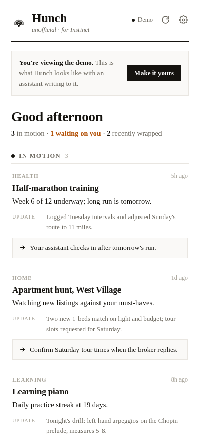

<div align="center">


# Hunch

**The unofficial open-source dashboard for [Instinct](https://instinct.com).**

What is your Instinct working on right now? One private page
answers it in ten seconds: what's in motion, what's waiting on you,
and what just wrapped.

[Live demo](https://hunch-app.pages.dev) · [Setup](#setup) · [How it works](#how-it-works) · [Security](#security-model)



[](LICENSE)
[](#setup)
[](#setup)

</div>

## Why this exists

Your Instinct does real work in the background, but the work lives inside a chat thread. Finding out what's active, what's blocked on you, and what's done means rereading the conversation. Hunch is a window onto that state: your Instinct writes short plain-English rows as work happens, and this page renders them. You could call it observability for your Instinct - what's in motion, what changed, where it's blocked, and what needs you - pointed at a life instead of a server fleet. It's a window, not a control panel - nothing in the app edits the work itself.

[Instinct](https://instinct.com) is a personal AI assistant you text or call - and it has no project view, because its whole pitch is "no new interfaces." Hunch fills that gap from the outside. **It is unofficial: made by a user, not made, endorsed, or supported by Instinct.** The name is a synonym, not a claim.

## Built for your Instinct to run

Hunch is designed to be installed and maintained by your Instinct, not by you. The onboarding flow:

1. **You say one sentence.** Send your Instinct this repo: "set up Hunch for me."
2. **Your Instinct reads [`AGENTS.md`](AGENTS.md)** and explains the privacy boundary in plain English: what data it will write, where it lives (one encrypted file on a static host), who can read it (whoever holds your link), and that the link itself is the password. You approve before anything happens.
3. **Your Instinct does everything.** Deploys the page to a free static host, publishes the first encrypted snapshot, and hands you the link. There is no account to create and no human-verification wall - the default path has zero unavoidable human steps.
4. **You open the link.** Already populated, already yours. Bookmark it: the bookmark *is* your key, so it syncs to your other devices the way your bookmarks do.

You stay the trust layer throughout: your host, your file, every publish inspectable as one small encrypted artifact. Details for your Instinct live in [`AGENTS.md`](AGENTS.md); the write contract lives in [`WRITER.md`](WRITER.md). Prefer email sign-in and per-reader access control instead of a bearer link? The Supabase backend stays fully supported - see [Optional: Supabase backend](#optional-supabase-backend).

## The demo

**[hunch-app.pages.dev](https://hunch-app.pages.dev)** opens with demo data - no account, no setup. That's the whole product in one glance. When you want your own, "Make it yours" walks you through connecting a backend.

## Setup

The default backend is an encrypted snapshot: one small file your Instinct publishes next to the page. No database, no account, no build step, $0.

### Default: encrypted snapshot (agent-led, no human gates)

Your Instinct needs any static host it can write to - Cloudflare Pages direct upload, Netlify, GitHub Pages, S3, `npx surge` - in an account you own. Then:

1. **Deploy the page.** Put `index.html` on the host (plus `supabase.min.js` only if you might use the optional backend).
2. **Publish a snapshot.** `node publish.mjs state.json <site-dir> --base-url https://your-hunch-url` encrypts the state with a fresh random AES-256-GCM key and writes `snapshot.enc`.
3. **Deploy `snapshot.enc` alongside the page.** Same host, same directory.
4. **Hand the owner the printed link.** It looks like `https://your-hunch-url/#k=...`. The part after `#` is the decryption key; browsers never send the fragment with any request, so the host only ever sees ciphertext.

From then on, an update is one command: re-run the publisher with fresh state and redeploy the small file. **Rotation** is the same command - every publish uses a new key, so old links stop working the moment the new file lands. **Revocation** is deleting `snapshot.enc`.

> **The link is the password.** Anyone holding the full link can read the dashboard until the key is rotated. There is no per-reader sign-in and no audit log in this mode. Keep the link out of screenshots, tickets, shared notes, and logs; if it leaks, one republish kills it. If you need named readers or an audit trail, use the Supabase backend below.

Keep `snapshot.enc` out of git (it is gitignored): ciphertext history in a repo is needless metadata. For git-connected hosts, publish the file through the host's direct-upload or API path instead of a commit.

### Optional: Supabase backend

For people who prefer email sign-in and per-reader access control over a bearer link. Ten minutes, $0, no build step. Honest tradeoffs: creating the account requires an interactive human-verification step (agents are blocked by it on purpose), free projects pause after about a week of inactivity unless a scheduled write keeps them alive, and your data sits as readable text inside a hosted database you manage.

1. **Create a Supabase project** (free) at [supabase.com](https://supabase.com).
2. **Add your sign-in user.** In Authentication settings, disable new sign-ups, then add your email as a user. Copy the user's UID.
3. **Run [`setup.sql`](setup.sql)** in the SQL editor: paste your UID on the marked line first, then run the whole file. It creates the table, locks it to you with row-level security, and seeds demo rows.
4. **Point sign-in links at the app.** In Authentication → URL Configuration, set the Site URL to your Hunch address.
5. **Connect the app.** Open your Hunch page, choose *Make it yours*, and paste your project URL + publishable anon key. They live only in your browser's local storage.
6. **Wire up the writer.** Hand your Instinct the service-role key and [`WRITER.md`](WRITER.md). It upserts one plain-English row per user-visible outcome.

One backend per installation - no syncing and no simultaneous stores. Switching later is a re-setup, not a migration: the dashboard holds no data of its own either way.

<details>
<summary>Prefer to self-host the page?</summary>

It's one `index.html` (plus the vendored Supabase client for the optional backend). Drop the files on any static host. No bundler, no framework, no environment variables: snapshot mode needs no configuration at all, and Supabase connection settings are entered in the app, not the code.

</details>

## How it works

```
Your Instinct    ── encrypts one small JSON snapshot (fresh AES-256-GCM key per publish) ──▶  snapshot.enc on your static host
Your phone      ── fetches the ciphertext, decrypts locally with the key from your link ──▶  one static page
```

- **Frontend:** one `index.html`. No build step.
- **Backend (default):** `snapshot.enc`, an AES-256-GCM encrypted JSON envelope on the same static host.
- **Backend (optional):** Supabase free tier (Postgres, magic-link email auth, row-level security).
- **Writer:** your Instinct, via `publish.mjs` (snapshot) or the Supabase REST API.
- **Corrections:** tell your Instinct in chat. It owns the data and republishes; direct edits get overwritten on the next publish.

Cost to run for one person: **$0** on free plans.

## Security model

**Default: encrypted snapshot.**

- The host stores and serves only ciphertext. The decryption key lives after the `#` in your link, and browsers never send that fragment with any request.
- The link is the password: anyone holding it can read the dashboard until rotation. No per-reader auth, no audit log. Rotation is one republish; full revocation is deleting one file.
- Fresh random key on every publish - there is nothing to manage, and nothing to forget to rotate.
- Lost your link? Ask your Instinct to republish; it holds the state, not your old key, and the new link replaces the old one.
- Export is the snapshot JSON itself; deletion is removing one file.

**Optional: Supabase backend.**

- Sign-in is a magic link to your email; no passwords. Sign-ups are disabled, so a stranger's email gets rejected.
- Postgres row-level security releases rows only to your user id - even holding the publishable key, nobody else can read them.
- The service-role key stays server-side with the writer. Never in the page, the repo, or the browser.
- Your data sits as readable text in a hosted database you manage; free projects pause after about a week of inactivity.

**Either way.**

- The app is read-only: there is no write path from the browser at all.
- No analytics, no trackers, no third-party requests: the page uses system typefaces and a vendored Supabase client. The only network calls it makes are to your own backend.
- The hosted build at hunch-app.pages.dev is byte-identical to `index.html` in this repo. Self-host if you'd rather not trust a hosted copy.

## Why "Hunch"?

Because "hunch" is a synonym for instinct - and that's exactly what this is: instinct, unofficially. As of September 2026, Instinct's own site describes the product as having "no new interfaces," and we found no public project/status view for personal AI assistants. The closest public work is observability tooling for *coding* agents (agent kanban boards, sub-agent dashboards), which is developer tooling, not a personal-life view. If you know of one, open an issue.

## Files

- `index.html` - the whole app (markup, styles, logic, demo mode, both backends, setup flow)
- `publish.mjs` - the snapshot publisher: state JSON in, encrypted `snapshot.enc` out
- `AGENTS.md` - the Instinct-facing contract: install path, boundaries, writer rules
- `WRITER.md` - the write contract in detail, with copy-paste commands
- `supabase.min.js` - Supabase JS client (MIT, © Supabase), used only by the optional backend
- `setup.sql` - table + row-level security + demo rows, for the optional backend
- `fallbacks/cloudflare-d1/` - a working third backend (Worker + D1) parked for future needs like audit logs or querying
- `assets/` - logo and screenshots

## License

[MIT](LICENSE). Take it, rename it, make it yours.
